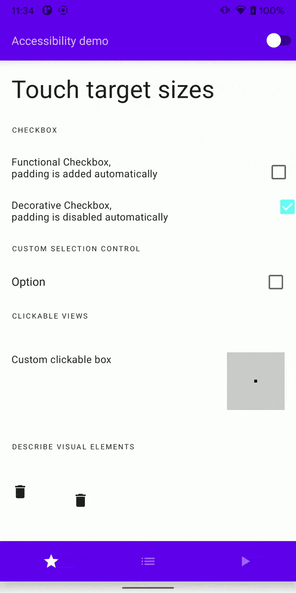
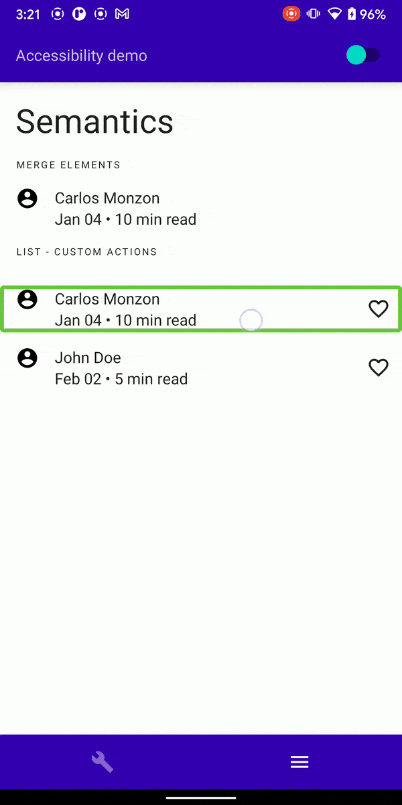
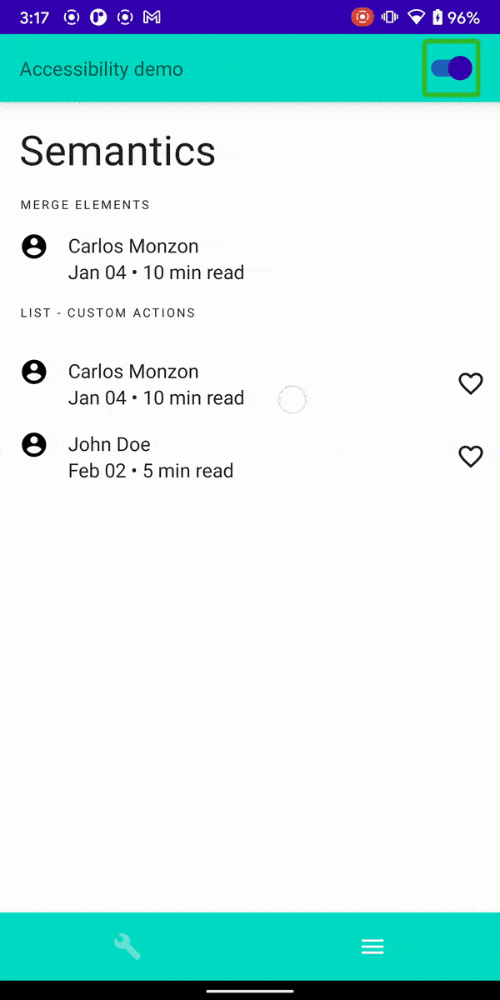
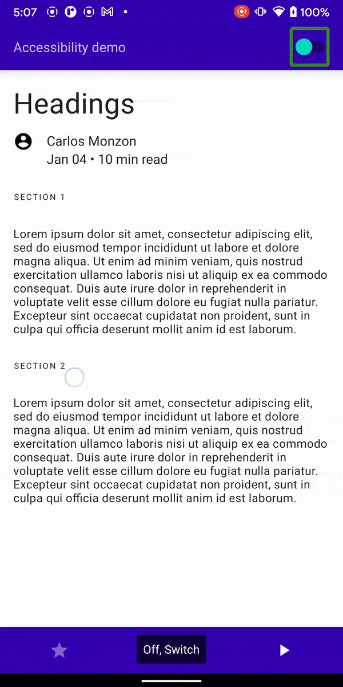
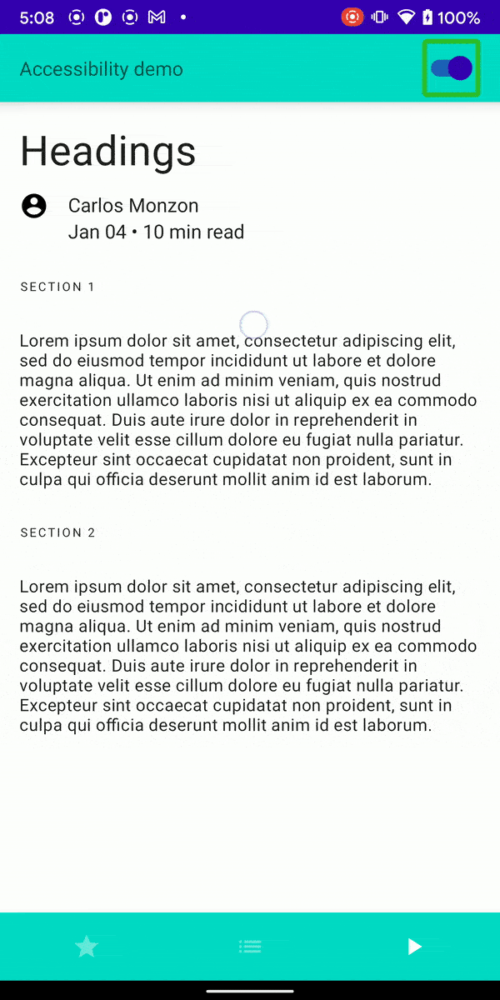

# ComposeAccessibilityApp
Compose app that shows compose accessibility best practices following [official documentation](https://developer.android.com/jetpack/compose/accessibility)

## Intro
Demo app switches between accessibility compose elements on the fly when activating the switch in the toolbar.
It is important to turn on the screen reader available in your android phone to verify accessibility behaviors. (ie: Talkback)


## Topics:

### 1. Essentials: Visual elements, touch area, custom selection controls, clickable composable



### 2. Semantics: Merge composables, custom actions in list items.

Accessibility elements off:



Accessibility elements on:



### 3. Headings
> Tip: Enable Heading reading control to enable this functionality in talkback:
> Enable Talkback
> Swipe up and down in the same gesture until Headings reading control is selected.

Accessibility elements off:



Accessibility elements on:



## LICENSE

```
MIT License

Copyright (c) 2021 Carlos Monzon

Permission is hereby granted, free of charge, to any person obtaining a copy
of this software and associated documentation files (the "Software"), to deal
in the Software without restriction, including without limitation the rights
to use, copy, modify, merge, publish, distribute, sublicense, and/or sell
copies of the Software, and to permit persons to whom the Software is
furnished to do so, subject to the following conditions:

The above copyright notice and this permission notice shall be included in all
copies or substantial portions of the Software.

THE SOFTWARE IS PROVIDED "AS IS", WITHOUT WARRANTY OF ANY KIND, EXPRESS OR
IMPLIED, INCLUDING BUT NOT LIMITED TO THE WARRANTIES OF MERCHANTABILITY,
FITNESS FOR A PARTICULAR PURPOSE AND NONINFRINGEMENT. IN NO EVENT SHALL THE
AUTHORS OR COPYRIGHT HOLDERS BE LIABLE FOR ANY CLAIM, DAMAGES OR OTHER
LIABILITY, WHETHER IN AN ACTION OF CONTRACT, TORT OR OTHERWISE, ARISING FROM,
OUT OF OR IN CONNECTION WITH THE SOFTWARE OR THE USE OR OTHER DEALINGS IN THE
SOFTWARE.
```